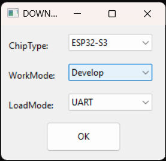
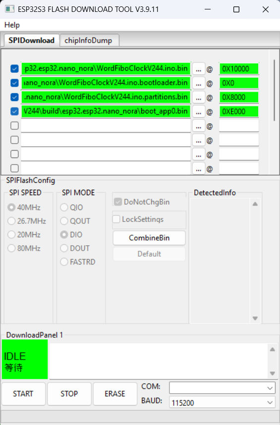
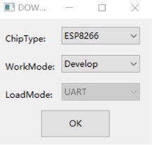
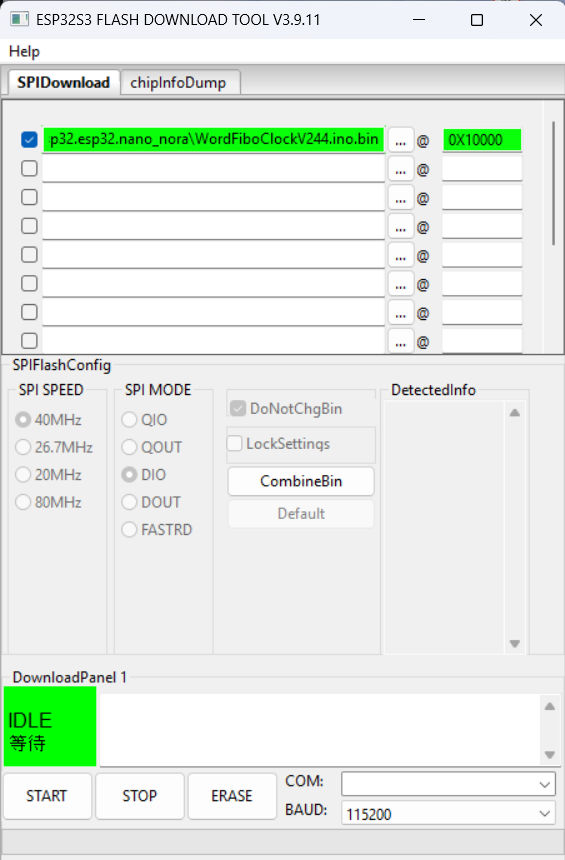
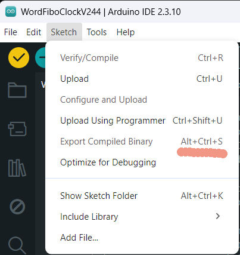

# Arduino Nano ESP32 – vastgelopen board herstellen

Deze handleiding beschrijft hoe een vastgelopen of niet meer startende
Arduino Nano ESP32 (ESP32-S3) weer teruggebracht wordt naar een werkend
board dat via de Arduino IDE te gebruiken is. Tevens wordt beschreven hoe
met de **Flash Download Tool** losse `.bin`-bestanden geflasht kunnen
worden.

> **Goed om te weten:** de echte ROM-bootloader van de ESP32-S3-chip zit
> ingebakken in de chip zelf en kan door geen enkele firmware overschreven
> worden. Herstel is dus altijd mogelijk.

## 0. Kort overzicht

| 1. Tool openen | 2. Downloadmode + bestanden laden |
|---|---|
|  |  |
| Open de Flash Download Tool. Kies in het eerste scherm **ChipType: ESP32-S3**, **WorkMode: Develop**, **LoadMode: UART** en klik OK. | Zet het board in downloadmode door **B1** kort te sluiten met **GND** en de **RST**-knop te activeren. Laad daarna `bootloader.bin`, `partitions.bin`, `boot_app0.bin` en de sketch-`.bin` op hun adressen en klik op **START**. |

De volledige toelichting per stap staat in de hoofdstukken hieronder.

## 1. Het board in downloadmode zetten

Bij een vastgelopen board of het ontbreken van geldige firmware functioneert
de automatische Arduino-reset (het togglen van de DTR/RTS-lijnen) niet.
Volgens de officiële [Arduino Nano ESP32 cheat sheet](https://docs.arduino.cc/tutorials/nano-esp32/cheat-sheet/)
zijn er twee methoden om het board handmatig in een herstelmodus te zetten:

### Optie A – Arduino Bootloader-mode (softwarematig, geen jumper vereist)

1. Druk op **RESET** en druk deze nogmaals in zodra de RGB-LED begint te knipperen (dubbele reset).
2. Het board bevindt zich in bootloadermode zodra de groene LED langzaam pulseert.

Deze methode is afhankelijk van de Arduino-bootloaderpartitie, die de
dubbele-resetdetectie uitvoert. Is deze partitie overschreven door firmware
van derden, dan ontbreekt die detectielogica en wordt het board niet als
seriële COM-poort geënumereerd. In dat geval is optie B vereist.

### Optie B – ROM Boot mode via de B1-pin (functioneert onafhankelijk van de aanwezige firmware)

> Let op: de juiste pin heet volgens Arduino **B1**, niet B0. Op de Nano
> ESP32 is B1 = GPIO0 (de standaard ESP32-downloadpin); B0 = GPIO46 heeft
> een andere functie.

1. Kortsluit de **GND**-pin en de **B1**-pin met een jumperdraad. De RGB-LED wordt groen.
2. Houd de kortsluiting tussen GND en B1 in stand en activeer kort de witte **RST**-knop bovenop het board.
3. Verbreek de verbinding tussen GND en B1. De RGB-LED blijft branden, nu in paarse kleur: het board bevindt zich in firmware-downloadmode.

Bron: [Arduino Help Center – Reset the Arduino bootloader on the Nano ESP32](https://support.arduino.cc/hc/en-us/articles/9810414060188-Reset-the-Arduino-bootloader-on-the-Nano-ESP32).

Controleer in Windows Device Manager welke COM-poort verschijnt. Bij de Nano
ESP32 kan het poortnummer wijzigen zodra het board van normale modus naar
downloadmode overgaat (bijvoorbeeld COM6 → COM5), doordat de USB-descriptor
van de ROM-bootloader afwijkt van die van de applicatie-firmware.

> **Kortste officiële weg (alternatief voor de Flash Download Tool):** zet
> het board met optie B in downloadmode, kies in Arduino IDE onder
> **Tools → Programmer** de optie **Esptool**, doe **Tools → Burn
> Bootloader** (wist de flash) en daarna **Sketch → Upload Using
> Programmer**. Zie hetzelfde [Help Center-artikel](https://support.arduino.cc/hc/en-us/articles/9810414060188-Reset-the-Arduino-bootloader-on-the-Nano-ESP32)
> voor de volledige stappen.

> **Let op:** dit werkt alleen als het board niet helemaal vastgelopen is.
> Als er een andere/vreemde ESP32-bootloader op terecht is gekomen
> (bijvoorbeeld doordat de factory-/bootloader-partitie overschreven is met
> esptool, esp-idf of PlatformIO), reageert Arduino IDE's Upload-knop niet
> meer en **werkt alleen de Flash Download Tool** (met de 4 losse bestanden
> op de juiste adressen) nog. Zie bijvoorbeeld deze voorbeelden uit de
> praktijk:
>
> - [Arduino Forum – BIN flashing Nano ESP32 problem](https://forum.arduino.cc/t/bin-flashing-nano-esp32-problem/1320594): bevestigt dat als de factory-partitie overschreven is, alleen de esptool/jumper-methode nog werkt.
> - [odelayIO/Recovering-Bricked-Arduino-Nano-ESP32 (GitHub)](https://github.com/odelayIO/Recovering-Bricked-Arduino-Nano-ESP32): herstel van een Nano ESP32 die niet meer via de IDE te programmeren was, met esptool buiten de IDE om.

> Zolang er *geen* geldige applicatie-firmware in de flash aanwezig is,
> faalt de boot-sequentie en activeert de RTC-watchdog een voortdurende
> resetcyclus. Daardoor verschijnt en verdwijnt de COM-poort continu. Een
> COM-poort dient pas geselecteerd te worden *nadat* de procedure van optie
> A of B hierboven is uitgevoerd.

## 2. De Flash Download Tool installeren

Espressif's officiële "Flash Download Tool" is een Windows GUI-programma
waarmee, zonder Python of esptool, rechtstreeks `.bin`-bestanden naar
specifieke flash-adressen geschreven kunnen worden.

- Officiële downloadpagina: [espressif.com – Support / Download / Tools](https://www.espressif.com/en/support/download/other-tools)
- Officiële User Guide (met screenshots): [docs.espressif.com – Flash Download Tool User Guide](https://docs.espressif.com/projects/esp-test-tools/en/latest/esp32/production_stage/tools/flash_download_tool.html)
- Directe download van de zip: [dl.espressif.com/public/flash_download_tool.zip](https://dl.espressif.com/public/flash_download_tool.zip)
- Lokale kopie (al gedownload voor dit project): [FDTsrc/flash_download_tool.zip](FDTsrc/flash_download_tool.zip)

Pak de zip uit naar een map naar keuze en start `flash_download_tool.exe`.

### Chip en modus kiezen


Kies **ChipType: ESP32-S3**, **WorkMode: Develop**, **LoadMode: UART**, en klik OK.

### Hoofdscherm van de tool



Na het kiezen van chip en modus opent het hoofdscherm met het tabblad SPIDownload.

## 3. Eén los .bin-bestand flashen

Om alleen een enkel `.bin`-bestand weg te schrijven (bijvoorbeeld om te
testen of de verbinding werkt, of om alleen de sketch bij te werken terwijl
bootloader en partities al correct staan):



Het SPIDownload-tabblad met één bestand ingevuld op adres `0x10000`.

1. Klik op de **...**-knop naast de eerste regel en selecteer het gewenste `.bin`-bestand.
2. Vul het adres in het vakje ernaast in (bijvoorbeeld `0x10000` voor een sketch — zie tabel hieronder).
3. Vink het selectievakje vóór die regel aan.
4. Kies onderin de juiste **COM**-poort en een **BAUD** van bijvoorbeeld 921600.
5. Zet het board in downloadmode (zie stap 1) en klik direct daarna op **START**.

## 4. Volledig herstel: bootloader + partities + app

Als de flash helemaal leeg is (bijvoorbeeld na een `erase_flash`), is meer
dan alleen de sketch nodig. Gebruik in Arduino IDE eerst **Sketch → Export
Compiled Binary** op een simpele sketch (bv. Blink) voor het board "Arduino
Nano ESP32". Dit levert de volgende bestanden op in de sketch-map:



Arduino IDE: **Sketch → Export Compiled Binary** (Alt+Ctrl+S).

| Bestand | Adres | Omschrijving |
|---|---|---|
| `*.bootloader.bin` | `0x0` | Tweede-traps bootloader |
| `*.partitions.bin` | `0x8000` | Partitietabel |
| `boot_app0.bin` | `0xe000` | OTA-selectiegegevens |
| `*.ino.bin` | `0x10000` | De sketch zelf (app) |

Voeg in de Flash Download Tool alle 4 regels toe met hun eigen bestand en
adres, vink alle 4 de checkboxes aan, zet het board in downloadmode en klik
op **START**.


Alle 4 bestanden toegevoegd en aangevinkt (app, bootloader, partitions, boot_app0) — klaar om op START te klikken.

> **Kortste weg:** in plaats van deze 4 bestanden handmatig te flashen, kan
> ook eenvoudigweg de **Upload**-knop in Arduino IDE gebruikt worden zodra
> het board in downloadmode staat en de COM-poort zichtbaar is — de IDE
> schrijft dan zelf automatisch alle 4 bestanden naar de juiste adressen.

## 5. Verbinding testen zonder te flashen (optioneel, met esptool)

Om vooraf te controleren of het board reageert, zonder gebruik te maken van
de GUI-tool:

```bash
pip install esptool
python -m esptool --chip esp32s3 --port COM5 --connect-attempts 10 chip_id
```

Reageert dit met chip-informatie, dan functioneert de verbinding en kan
verder gegaan worden met flashen (stap 3 of 4).

---

Bronnen: [Arduino – Nano ESP32 Cheat Sheet / User Manual](https://docs.arduino.cc/tutorials/nano-esp32/cheat-sheet/) ·
[Arduino Help Center – Reset the Arduino bootloader on the Nano ESP32](https://support.arduino.cc/hc/en-us/articles/9810414060188-Reset-the-Arduino-bootloader-on-the-Nano-ESP32) ·
[Espressif – Download Tools](https://www.espressif.com/en/support/download/other-tools) ·
[Espressif – Flash Download Tool User Guide](https://docs.espressif.com/projects/esp-test-tools/en/latest/esp32/production_stage/tools/flash_download_tool.html)

Screenshots in `FDTsrc/` zijn eigen schermafbeeldingen, op het hoofdscherm van de tool na (dat komt uit de officiële Espressif-documentatie).
